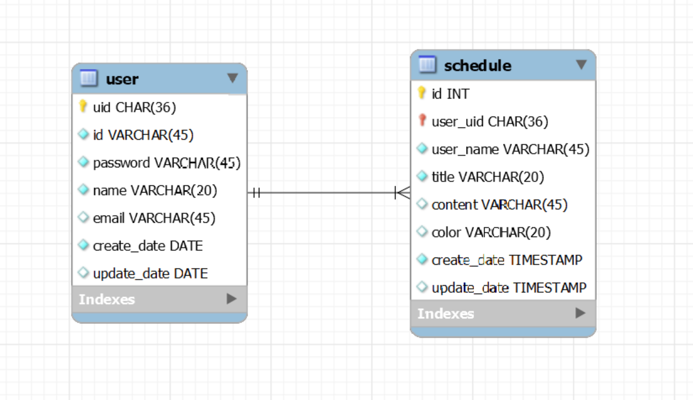

# Schedule_management

## API 명세서
### Schedules
| 기능          |Method|URL| Request           |Response| 상태코드                                                 |
|-------------|---|---|-------------------|---|------------------------------------------------------|
| 일정 생성       |`POST`|/api/schedules| 요청 body           |등록 정보| 200: 정상 등록, 400: 비정상 값 , 404: 등록되지 않음                |
| 전체 일정 조회    |`GET`|/api/schedules| X                 |다건 응답 정보| 200: 정상 조회                                           |
| 선택 일정 조회    |`GET`|/api/schedules/{schedule_id}| 요청 param, 요청 body |단건 응답 정보| 200: 정상 조회, 404: 일정이 사라짐, 404: 일정이 사라짐               |
| 선택 일정 전체 수정 |`PUT`|/api/schedules/{schedule_id}| 요청 param, 요청 body |수정 정보| 200: 정상 수정, 400: 비정상 값, 403: 일정 주인이 아님, 404: 일정이 사라짐 |
| 선택 일정 부분 수정 |`PUT`|/api/schedules/{schedule_id}| 요청 param, 요청 body |수정 정보| 200: 정상 수정, 400: 비정상 값, 403: 일정 주인이 아님, 404: 일정이 사라짐 |
| 선택 일정 삭제    |`DELETE`|/api/schedules/{schedule_id}| 요청 param          | 삭제 정보 | 200: 정상 삭제, 403: 일정 주인이 아님, 404: 일정이 사라짐                             |

<details>
  <summary><b>일정 생성</b></summary>
    
- 기본정보
  
    <table>
      <tr>
        <td ><b>메소드</b></td>
        <td ><b>요청 URL</b></td>
      </tr>
      <tr>
        <td>POST</td></td>
        <td >/api/schedules</td>
      </tr>
    </table>


- 예제

  - 요청: POST /api/schedules
   
    ```json
    {
      "user_uid": "67037103-9bf1-11ef-a978-005056c00001",
      "user_name": "kim",
      "title": "자바객체 읽기",
      "content": "orm 공부하기",
      "color": "RED"
    }
    ```

  - 응답
      
    HTTP/1.1 200 OK
    
    ``` json
    {
      "user_uid": "67037103-9bf1-11ef-a978-005056c00001",
      "id": 0,
      "user_name": "kim",
      "title": "자바객체 읽기",
      "content": "orm 공부하기",
      "color": "RED",
      "create_date": null,
      "update_date": null
    }
    ```

- 본문
  
  - 요청
    
    <table>
        <tr>
          <td><b>이름</b></td>
          <td><b>타입</b></td>
          <td><b>설명</b></td>
          <td><b>필수</b></td>
        </tr>
        <tr>
          <td>user_uid</td>
          <td>String</td>
          <td>유저 UID</td>
          <td> O </td>
        </tr>
        <tr>
          <td>user_name</td>
          <td>String</td>
          <td>유저 이름</td>
          <td> O </td>
        </tr>
        <tr>
          <td>title</td>
          <td>String</td>
          <td>일정 제목</td>
          <td> O </td>
        </tr>
        <tr>
          <td>content</td>
          <td>String</td>
          <td>일정 내용</td>
          <td> X </td>
        </tr>
        <tr>
          <td>color</td>
          <td>String</td>
          <td>일정에 나타낼 색깔</td>
          <td> X </td>
        </tr>
      </table>

  - 응답

    <table>
        <tr>
          <td><b>이름</b></td>
          <td><b>타입</b></td>
          <td><b>설명</b></td>
          <td><b>필수</b></td>
        </tr>
        <tr>
          <td>user_uid</td>
          <td>String</td>
          <td>유저 UID</td>
          <td> O </td>
        </tr>
        <tr>
          <td>id</td>
          <td>int</td>
          <td>일정 ID</td>
          <td> X </td>
        </tr>
        <tr>
          <td>user_name</td>
          <td>String</td>
          <td>유저 이름</td>
          <td> O </td>
        </tr>
        <tr>
          <td>title</td>
          <td>String</td>
          <td>일정 제목</td>
          <td> O </td>
        </tr>
        <tr>
          <td>content</td>
          <td>String</td>
          <td>일정 내용</td>
          <td> X </td>
        </tr>
        <tr>
          <td>color</td>
          <td>String</td>
          <td>일정에 나타낼 색깔</td>
          <td> X </td>
        </tr>
        <tr>
          <td>create_date</td>
          <td>String</td>
          <td>일정 등록 날짜</td>
          <td> X </td>
        </tr>
        <tr>
          <td>update_date</td>
          <td>String</td>
          <td>일정에 수정 날짜</td>
          <td> X </td>
        </tr>
      </table>
  
    
</details>

<details>
  <summary><b>전체 일정 조회 </b></summary>

- 기본정보
  
    <table>
      <tr>
        <td ><b>메소드</b></td>
        <td ><b>요청 URL</b></td>
      </tr>
      <tr>
        <td>GET</td></td>
        <td >/api/scedules</td>
      </tr>
    </table>


- 예제

  - 요청 : X

- 응답
 
  HTTP/1.1 200 OK
    
  ```json
    [
      {
        "user_uid": "67037103-9bf1-11ef-a978-005056c00001",
        "id": 86,
        "user_name": "kim",
        "title": "자바객체 읽기",
        "content": "orm 공부하기",
        "color": "RED",
        "create_date": "2024-11-08 09:23:59",
        "update_date": "2024-11-08 09:23:59"
      },
      {
      "user_uid": "67037103-9bf1-11ef-a978-005056c00001",
      "id": 85,
      "user_name": "kim",
      "title": "자바객체 읽기",
      "content": "orm 공부하기",
      "color": "RED",
      "create_date": "2024-11-08 09:17:19",
      "update_date": "2024-11-08 09:17:19"
      }, ...
  ]
  ```

- 본문
  
  - 요청 : X

  - 응답
  
    <table>
        <tr>
          <td><b>이름</b></td>
          <td><b>타입</b></td>
          <td><b>설명</b></td>
          <td><b>필수</b></td>
        </tr>
        <tr>
          <td>id</td>
          <td>int</td>
          <td> 일정의 ID </td>
          <td> O </td>
        </tr>
        <tr>
          <td>user_uid</td>
          <td>String</td>
          <td> 유저 UID </td>
          <td> O </td>
        </tr>
        <tr>
          <td>user_name</td>
          <td>String</td>
          <td> 유저 이름 </td>
          <td> O </td>
        </tr>
        <tr>
          <td>title</td>
          <td>String</td>
          <td>일정 제목</td>
          <td> O </td>
        </tr>
        <tr>
          <td>content</td>
          <td>String</td>
          <td>일정 내용</td>
          <td> X </td>
        </tr>
        <tr>
          <td>color</td>
          <td>String</td>
          <td>일정에 나타낼 색깔</td>
          <td> X </td>
        </tr>
        <tr>
          <td>create_date</td>
          <td>String</td>
          <td>일정의 생성 날짜 (YYYY-MM-DD)</td>
          <td> O </td>
        </tr>
        <tr>
          <td>update_date</td>
          <td>String</td>
          <td>일정의 수정 날짜 (YYYY-MM-DD)</td>
          <td> X </td>
        </tr>
      </table>

    
</details>

<details>
  <summary><b>선택 일정 조회 </b></summary>

- 기본정보
  
    <table>
      <tr>
        <td ><b>메소드</b></td>
        <td ><b>요청 URL</b></td>
      </tr>
      <tr>
        <td>GET</td></td>
        <td >/api/scedules/{schedule_id}</td>
      </tr>
    </table>


- 예제

  - 요청: GET /api/schedules/{schedule_id}

  - 응답
 
    HTTP/1.1 200 OK

    ```json
     {
      "user_uid": "67037103-9bf1-11ef-a978-005056c00001",
      "id": 85,
      "user_name": "kim",
      "title": "자바객체 읽기",
      "content": "orm 공부하기",
      "color": "RED",
      "create_date": "2024-11-08",
      "update_date": "2024-11-08"
    }
    ```
- 본문
  
  - 요청 
      
      <table>
        <tr>
          <td><b>이름</b></td>
          <td><b>타입</b></td>
          <td><b>설명</b></td>
          <td> 필수 </td>
        </tr>
        <tr>
          <td>schedule_id</td>
          <td>int</td>
          <td> 일정 id </td>
          <td> O </td>
        </tr>
      </table>

  - 응답
    
    <table>
        <tr>
          <td><b>이름</b></td>
          <td><b>타입</b></td>
          <td><b>설명</b></td>
          <td> O </td>
        </tr>
        <tr>
          <td>id</td>
          <td>int</td>
          <td> 일정 id </td>
          <td> O </td>
        </tr>
        <tr>
          <td>user_uid</td>
          <td>String</td>
          <td> 유저 UID </td>
          <td> O </td>
        </tr>
        <tr>
          <td>user_name</td>
          <td>String</td>
          <td> 유저 이름 </td>
          <td> O </td>
        </tr>
        <tr>
          <td>title</td>
          <td>String</td>
          <td>일정 제목</td>
          <td> O </td>
        </tr>
        <tr>
          <td>content</td>
          <td>String</td>
          <td>일정 내용</td>
          <td> X </td>
        </tr>
        <tr>
          <td>color</td>
          <td>String</td>
          <td>일정에 나타낼 색깔</td>
          <td> X </td>
        </tr>
        <tr>
          <td>create_date</td>
          <td>String</td>
          <td>일정의 생성 날짜 (YYYY-MM-DD)</td>
          <td> O </td>
        </tr>
        <tr>
          <td>update_date</td>
          <td>String</td>
          <td>일정의 수정 날짜 (YYYY-MM-DD)</td>
          <td> X </td>
        </tr>
      </table>

    
</details>

<details>
  <summary><b>선택 일정 전체 수정 </b></summary>

- 기본정보
  
    <table>
      <tr>
        <td ><b>메소드</b></td>
        <td ><b>요청 URL</b></td>
      </tr>
      <tr>
        <td>PUT</td></td>
        <td >/api/scedules/{schedule_id}</td>
      </tr>
    </table>


- 예제

  - 요청: PUT /api/schedules/{schedule_id}
  
    ```json
    {
      "user_uid": "9788896a-96a4-11ef-a978-005056c00001",
      "title" : "알고리즘 핵심 공부",
      "content" : "dfs",
      "color" : "BLUE"
    }
    ```
  - 응답

    HTTP/1.1 200 OK

    ```json
    {
      "user_uid": "67037103-9bf1-11ef-a978-005056c00001",
      "id": 84,
      "user_name": "kim",
      "title": "알고리즘 핵심전략",
      "content": "dfs",
      "color": "BLUE",
      "create_date": "2024-11-07",
      "update_date": "2024-11-08"
    }
    ```

- 본문

  - 요청 
    
    <table>
        <tr>
          <td><b>이름</b></td>
          <td><b>타입</b></td>
          <td><b>설명</b></td>
          <td> O </td>
        </tr>
        <tr>
          <td>user_uid</td>
          <td>String</td>
          <td> 유저 UID </td>
          <td> O </td>
        </tr>
        <tr>
          <td>title</td>
          <td>String</td>
          <td>일정 제목</td>
          <td> O </td>
        </tr>
        <tr>
          <td>content</td>
          <td>String</td>
          <td>일정 내용</td>
          <td> O </td>
        </tr>
        <tr>
          <td>color</td>
          <td>String</td>
          <td>일정에 나타낼 색깔</td>
          <td> O </td>
        </tr>
      </table>
  
  - 응답

    <table>
        <tr>
          <td><b>이름</b></td>
          <td><b>타입</b></td>
          <td><b>설명</b></td>
          <td> O </td>
        </tr>
        <tr>
          <td>id</td>
          <td>int</td>
          <td> 일정 id </td>
          <td> O </td>
        </tr>
        <tr>
          <td>user_uid</td>
          <td>String</td>
          <td> 유저 UID </td>
          <td> O </td>
        </tr>
        <tr>
          <td>user_name</td>
          <td>String</td>
          <td> 유저 이름 </td>
          <td> O </td>
        </tr>
        <tr>
          <td>title</td>
          <td>String</td>
          <td>일정 제목</td>
          <td> O </td>
        </tr>
        <tr>
          <td>content</td>
          <td>String</td>
          <td>일정 내용</td>
          <td> X </td>
        </tr>
        <tr>
          <td>color</td>
          <td>String</td>
          <td>일정에 나타낼 색깔</td>
          <td> X </td>
        </tr>
        <tr>
          <td>create_date</td>
          <td>String</td>
          <td>일정의 생성 날짜(YYYY-MM-DD)</td>
          <td> O </td>
        </tr>
        <tr>
          <td>update_date</td>
          <td>String</td>
          <td>일정의 수정 날짜 (YYYY-MM-DD)</td>
          <td> X </td>
        </tr>
      </table>

</details>

<details>
  <summary><b>선택 일정 부분 수정 </b></summary>

- 기본정보

    <table>
      <tr>
        <td ><b>메소드</b></td>
        <td ><b>요청 URL</b></td>
      </tr>
      <tr>
        <td>PATCH</td></td>
        <td >/api/scedules/{schedule_id}</td>
      </tr>
    </table>


- 예제

  - 요청: PATCH /api/schedules/{schedule_id}

    - > [제목], [내용], [색깔], [제목, 내용], [내용, 색깔], [제목, 색깔]... 유저가 주입하는 것에 따라 수정을 가변적으로 가능   

    1: 제목 내용 색깔 전부 수정
    ```json
    {
      "user_uid": "9788896a-96a4-11ef-a978-005056c00001",
      "title" : "알고리즘 핵심 공부",
      "content" : "dfs",
      "color" : "BLUE"
    }
    ```

    2: 제목만 수정
    ```json
    {
      "user_uid": "9788896a-96a4-11ef-a978-005056c00001",
      "title" : "알고리즘 핵심 공부"
    }
    ```    

    3: 내용, 색깔만 수정
    ```json
    {
      "user_uid": "9788896a-96a4-11ef-a978-005056c00001",
      "content" : "dfs",
      "color" : "BLUE"
    }
    ```    

  - 응답

    HTTP/1.1 200 OK

    ```json
    {
      "user_uid": "67037103-9bf1-11ef-a978-005056c00001",
      "id": 84,
      "user_name": "kim",
      "title": "알고리즘 핵심전략",
      "content": "dfs",
      "color": "BLUE",
      "create_date": "2024-11-07",
      "update_date": "2024-11-08"
    }
    ```

- 본문

  - 요청

    <table>
        <tr>
          <td><b>이름</b></td>
          <td><b>타입</b></td>
          <td><b>설명</b></td>
          <td> O </td>
        </tr>
        <tr>
          <td>user_uid</td>
          <td>String</td>
          <td> 유저 UID </td>
          <td> O </td>
        </tr>
        <tr>
          <td>title</td>
          <td>String</td>
          <td>일정 제목</td>
          <td> X </td>
        </tr>
        <tr>
          <td>content</td>
          <td>String</td>
          <td>일정 내용</td>
          <td> X </td>
        </tr>
        <tr>
          <td>color</td>
          <td>String</td>
          <td>일정에 나타낼 색깔</td>
          <td> X </td>
        </tr>
      </table>

  - 응답

    <table>
        <tr>
          <td><b>이름</b></td>
          <td><b>타입</b></td>
          <td><b>설명</b></td>
          <td> O </td>
        </tr>
        <tr>
          <td>id</td>
          <td>int</td>
          <td> 일정 id </td>
          <td> O </td>
        </tr>
        <tr>
          <td>user_uid</td>
          <td>String</td>
          <td> 유저 UID </td>
          <td> O </td>
        </tr>
        <tr>
          <td>user_name</td>
          <td>String</td>
          <td> 유저 이름 </td>
          <td> O </td>
        </tr>
        <tr>
          <td>title</td>
          <td>String</td>
          <td>일정 제목</td>
          <td> O </td>
        </tr>
        <tr>
          <td>content</td>
          <td>String</td>
          <td>일정 내용</td>
          <td> X </td>
        </tr>
        <tr>
          <td>color</td>
          <td>String</td>
          <td>일정에 나타낼 색깔</td>
          <td> X </td>
        </tr>
        <tr>
          <td>createdAt</td>
          <td>String</td>
          <td>일정의 생성 날짜 (YYYY-MM-DD)</td>
          <td> O </td>
        </tr>
        <tr>
          <td>updatedAt</td>
          <td>String</td>
          <td>일정의 수정 날짜 (YYYY-MM-DD)</td>
          <td> X </td>
        </tr>
      </table>

</details>

<details>
  <summary><b>선택 일정 삭제 </b></summary>

- 기본정보
  
    <table>
      <tr>
        <td ><b>메소드</b></td>
        <td ><b>요청 URL</b></td>
      </tr>
      <tr>
        <td>DELETE</td></td>
        <td >/api/schedules/{schedule_id}</td>
      </tr>
    </table>

- 예제

  - 요청: DELETE /api/schedules/{schedule_id}

     ```json
     {
        "user_uid": "67037103-9bf1-11ef-a978-005056c00001"
     }
      ```
 
  - 응답
 
    HTTP/1.1 200 OK

- 본문
    
  - 요청
      
      <table>
        <tr>
          <td><b>이름</b></td>
          <td><b>타입</b></td>
          <td><b>설명</b></td>
          <td><b>필수</b></td>
        </tr>
        <tr>
          <td>schedule_id</td>
          <td>String</td>
          <td> 유저 UID </td>
          <td> O </td>
        </tr>
      </table>
  
  - 응답: X


    
</details>

### Users
|기능|Method|URL|Request|Response| 상태코드                                 | 완성  |
|---|---|---|---|---|--------------------------------------|-----|
|유저 등록|`POST`|/api/users|요청 body|등록 정보| 200: 정상 등록, 400: 비정상 값               | O   |
|유저 정보 조회|`GET`|/api/users/{user_id}| 요청 param |단건 응답 정보| 200: 정상 조회, 404: 유저가 사라짐             | TBU |
|유저 수정|`PUT`|/api/users/{user_id}|요청 param, 요청 body|수정 정보| 200: 정상 수정, 400: 비정상 값, 404: 유저가 사라짐 | TBU |

<details>
  <summary><b>유저 등록</b></summary>
    
- 기본정보
  
    <table>
      <tr>
        <td ><b>메소드</b></td>
        <td ><b>요청 URL</b></td>
      </tr>
      <tr>
        <td>POST</td></td>
        <td >/api/users</td>
      </tr>
    </table>


- 예제

  - 요청
    
    ```json
     {
        "id": "tyh343",
        "password": "tghf",
        "name": "kim",
        "email" : "kimsparta@sparta.co.kr"
    }
    ```

  - 응답
    
    HTTP/1.1 200 OK
    
    ```json
     {
      "uid": null,
      "id": "spa1",
      "password": null,
      "name": null,
      "email": null
    }
    ```

- 본문
  
  - 요청
  
    <table>
        <tr>
          <td><b>이름</b></td>
          <td><b>타입</b></td>
          <td><b>설명</b></td>
          <td><b>필수</b></td>
        </tr>
        <tr>
          <td>user_id</td>
          <td>String</td>
          <td>유저 ID</td>
          <td> O </td>
        </tr>
        <tr>
          <td>password</td>
          <td>String</td>
          <td>유저 PW</td>
          <td> O </td>
        </tr>
        <tr>
          <td>name</td>
          <td>String</td>
          <td>유저 이름</td>
          <td> O </td>
        </tr>
        <tr>
          <td>email</td>
          <td>String</td>
          <td>유저 EMAIL</td>
          <td> X </td>
        </tr>
      </table>

  - 응답
  
    <table>
        <tr>
          <td><b>이름</b></td>
          <td><b>타입</b></td>
          <td><b>설명</b></td>
          <td><b>필수</b></td>
        </tr>
        <tr>
          <td>uid</td>
          <td>String</td>
          <td> 유저 ID</td>
          <td> O </td>
        </tr>
      </table>

    
</details>

<details>
  <summary><b>유저 정보 조회(TBU)</b></summary>
    
- 기본정보
  
    <table>
      <tr>
        <td ><b>메소드</b></td>
        <td ><b>요청 URL</b></td>
      </tr>
      <tr>
        <td>GET</td></td>
        <td >/api/users/{user_Id}</td>
      </tr>
    </table>


- 예제

  - 요청 : GET /api/schedules/{user_id}

  - 응답
    
    HTTP/1.1 200 OK
    
    ```json
     {
        "user_id": "tyh343",
        "name": "kim",
        "email" : "kimsparta@sparta.co.kr"
    }
    ```

- 본문

  - 요청
    
    <table>
        <tr>
          <td><b>이름</b></td>
          <td><b>타입</b></td>
          <td><b>설명</b></td>
          <td><b>필수</b></td>
        </tr>
        <tr>
          <td>user_id</td>
          <td>String</td>
          <td> 유저 id </td>
          <td> O </td>
        </tr>
      </table>

  - 응답
    
    <table>
        <tr>
          <td><b>이름</b></td>
          <td><b>타입</b></td>
          <td><b>설명</b></td>
          <td><b>필수</b></td>
        </tr>
        <tr>
          <td>id</td>
          <td>String</td>
          <td>유저 ID</td>
          <td> O </td>
        </tr>
        <tr>
          <td>name</td>
          <td>String</td>
          <td>유저 이름</td>
          <td> O </td>
        </tr>
        <tr>
          <td>email</td>
          <td>String</td>
          <td>유저 EMAIL</td>
          <td> X </td>
        </tr>
      </table>

    
</details>

<details>
  <summary><b>유저 수정(TBU)</b></summary>
    
- 기본정보
  
    <table>
      <tr>
        <td ><b>메소드</b></td>
        <td ><b>요청 URL</b></td>
      </tr>
      <tr>
        <td>PUT</td></td>
        <td >/api/users/{user_id}</td>
      </tr>
    </table>


- 예제

  - 요청
    
    ```json
     {
        "name": "kim",
        "email" : "kimsparta@sparta.co.kr"
    }
    ```

  - 응답
 
    HTTP/1.1 200 OK
 
    ```json
     {
        "uid": "9788896a-96a4-11ef-a978-005056c00001",
    }
    ```

- 본문

  - 요청 : PUT /api/schedules/{user_id}
  
      <table>
        <tr>
          <td><b>이름</b></td>
          <td><b>타입</b></td>
          <td><b>설명</b></td>
          <td><b>필수</b></td>
        </tr>
        <tr>
          <td>name</td>
          <td>String</td>
          <td>유저 이름</td>
          <td> x </td>
        </tr>
        <tr>
          <td>email</td>
          <td>String</td>
          <td>유저 EMAIL</td>
          <td> x </td>
        </tr>
      </table>

  - 응답
  
      <table>
        <tr>
          <td><b>이름</b></td>
          <td><b>타입</b></td>
          <td><b>설명</b></td>
          <td><b>필수</b></td>
        </tr>
        <tr>
          <td>uid</td>
          <td>String</td>
          <td>유저 UID</td>
          <td> O </td>
        </tr>
      </table>

    
</details>


---

## ERD




---

## SQL

#### 1. 테이블 생성 (Create)

```sql
-- Create users table
CREATE TABLE users (
    uid char(36) NOT NULL PRIMARY KEY,
    id varchar(45) NOT NULL,
    password varchar(45) NOT NULL,
    name varchar(20) NOT NULL,
    email varchar(45),
    create_date DATE NOT NULL,
    update_date DATE
);

-- Create schedules table
CREATE TABLE schedules (
    id int PRIMARY KEY NOT NULL AUTO_INCREMENT,
    user_uid char(36) NOT NULL,
    user_name varchar(45) NOT NULL,
    title varchar(20) NOT NULL,
    content varchar(100),
    color varchar(20),
    create_date DATE NOT NULL,
    update_date DATE,
    FOREIGN KEY (user_uid) REFERENCES users (uid)
)

```

#### 2. 유저 생성 및 일정 생성 (Insert)

```sql
-- Insert users
INSERT INTO user (uid, id, password, name, email, create_date)
VALUES (UUID(), 'tsd123', 'tyghbn','kim', 'sparta@teamsparta.co.kr', current_timestamp());

-- Insert schedules
INSERT INTO schedule (user_uid, user_name, title, content, color, create_date, update_date)
VALUES ('1ef5a95d-9cfd-11ef-a978-005056c00001','kim','kim','알고리즘','bfs','BLUE',CURRENT_TIMESTAMP(),CURRENT_TIMESTAMP());

-- Insert schedules without color
INSERT INTO schedule (user_uid, user_name, title, content,, create_date, update_date)
VALUES ('1ef5a95d-9cfd-11ef-a978-005056c00001','kim','kim','알고리즘','bfs', CURRENT_TIMESTAMP(),CURRENT_TIMESTAMP());


)

```

#### 3. 전체 일정 조회 (Select)

```sql
-- Select schedules
SELECT  user_uid, id, user_name, title, content, color, 
        date_format(create_date, '%Y-%m-%d') AS create_date,
        date_format(update_date, '%Y-%m-%d') AS update_date 
        FROM schedule ORDER BY update_date DESC


```

#### 4. 선택 일정 조회 (Select)

```sql
-- Select schedules with id 1
SELECT  user_uid, id, user_name, title, content, color,
        date_format(create_date, '%Y-%m-%d') AS create_date,
        date_format(update_date, '%Y-%m-%d') AS update_date
        FROM schedule ORDER BY update_date DESC
)

```

#### 5. 선택 일정 수정 및 유저 수정 (Update)

```sql
-- Update schedules with id 1
UPDATE schedule SET title = 'CS', content = 'Bean?', color = 'RED', update_date = CURRENT_DATE() WHERE id = 1;

-- PATCH schedules with id 1
UPDATE schedule SET title = 'Security', content = 'SQL injection', update_date = CURRENT_DATE() WHERE id = 1;

-- PATCH schedules with id 1
UPDATE schedule SET title = 'Exception', update_date = CURRENT_DATE() WHERE id = 1;
```

#### 6. 선택 일정 삭제  (Delete)

```sql
-- Delete schedules with id 1
DELETE FROM schedule WHERE id = 1;

```

#### 7. 페이지네이션

- pageNum : 페이지 번호
- pageSize : 한 페이지의 크기 

```sql
-- Delete schedules with id 1
SELECT * FROM schedule ORDER BY update_date DESC, id LIMIT pageNum,pageSize

```

